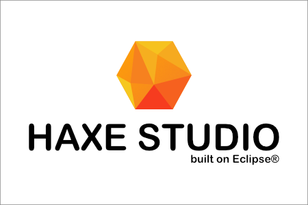
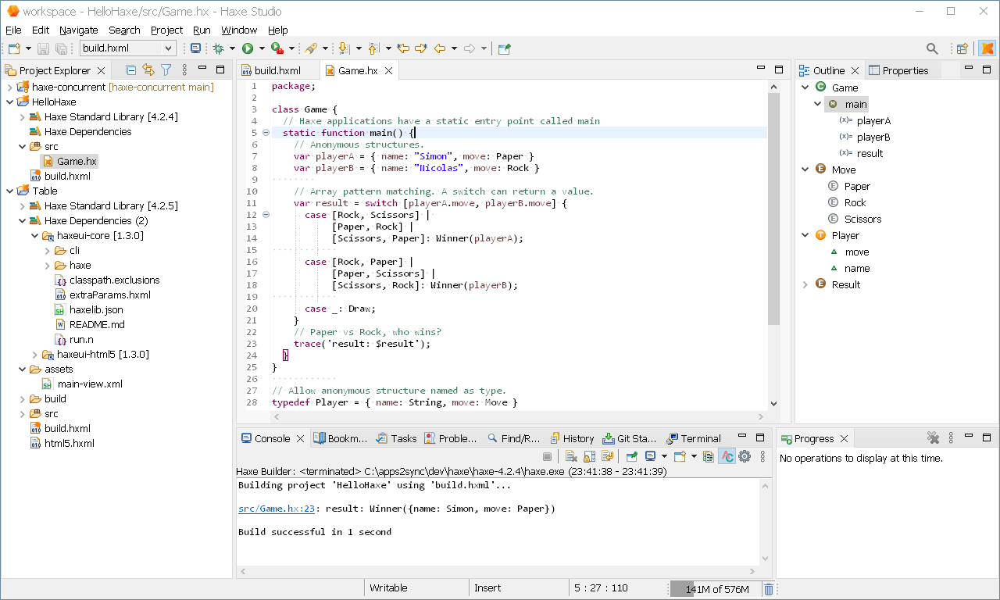

# Haxe Studio - the Eclipse based Haxe IDE

[](https://github.com/haxe4e/haxe-studio/actions/workflows/build.yml)
[](LICENSE.txt)
[](CODE_OF_CONDUCT.md)


**Feedback and high-quality pull requests are  highly welcome!**

1. [About](#about)
1. [What is it?](#what-is-it)
1. [Download](#download)
1. [Usage](#usage)
1. [Building from Sources](#building)
1. [Version History](#version-history)


## <a name="what-is-it"></a>What is it?

Haxe Studio is an [Eclipse](https://eclipse.org) based IDE for development using the [Haxe](https://haxe.org) general purpose
programming language.

It has the following plugins pre-installed:
- [haxe4e](https://github.com/haxe4e/haxe4e) - Haxe programming language support for the Eclipse IDE
- [Batch Editor](https://github.com/de-jcup/eclipse-batch-editor) - Windows Batch File Editor
- [EGit](https://www.eclipse.org/egit/) - Git support
- [Easy Shell](https://anb0s.github.io/EasyShell/) - opens shell windows or file managers from the popup menu in the navigation tree
- [Extra Syntax Highlighting](https://github.com/sebthom/extra-syntax-highlighting-eclipse-plugin) - syntax highlighting for additional languages
- [Find/Replace View](https://github.com/sebthom/findview-eclipse-plugin) - Convenient view to find/replace within the active editor
- [Indent Guide](https://github.com/grosenberg/IndentGuide) - Adds 'Indent Guide' (vertical line on indentation columns) to text editor
- [Open with Eclipse](https://github.com/sebthom/open-with-eclipse-plugin) - Windows File explorer context menu integration
- [ShellWax](https://github.com/eclipse/shellwax) - Bash File Editor
- [Wild Web Developer](https://github.com/eclipse/wildwebdeveloper) - Web Development Tools (CSS, HTML, JavaScript, TypeScript, XML support)





## <a name="download"></a>Download

You can download the latest platform-specific releases from here:

- Linux: https://github.com/haxe4e/haxe-studio/releases/download/latest/org.haxe4e.studio-linux.gtk.x86_64.tar.gz
- MacOS: https://github.com/haxe4e/haxe-studio/releases/download/latest/org.haxe4e.studio-macosx.cocoa.x86_64.tar.gz
- Windows: https://github.com/haxe4e/haxe-studio/releases/download/latest/org.haxe4e.studio-win.x86_64.zip
- Windows Portable App: https://github.com/haxe4e/haxe-studio/releases/download/latest/HaxeStudioPortable.paf.exe


## <a name="usage"></a>Usage

Please check the [Wiki](https://github.com/haxe4e/haxe-studio/wiki)

### Common Key Bindings

|Action                              | Eclipse             | Haxe Studio          | vscode
|------------------------------------|---------------------|----------------------|-------------------
|Open Find Actions (Command Palette) | `CTRL`+`3`          | `CTRL`+`3`           | `F1` / `CTRL`+`SHIFT`+`P`
|Open Quick Outline                  | `CTRL`+`O`          | `CTRL`+`O`           | n/a
|Full Screen Toggle                  | `ALT`+`F11`         | `F11`                | `F11`
|Format Source Code                  | `CTRL`+`SHIFT`+`F`  | `CTRL`+`SHIFT`+`F`   | `ALT`+`SHIFT`+`F`
|Go to Method/Type Declaration       | `F3`                | `F3`                 | `F12`
|Zoom In/Out                         | `CTRL`+`+/-`        | `CTRL`+`+/-`         | `CTRL`+`+/-`


## <a id="building"></a>Building from Sources

To ensure reproducible builds this Maven project inherits from the [vegardit-maven-parent](https://github.com/vegardit/vegardit-maven-parent)
project which declares fixed versions and sensible default settings for all official Maven plug-ins.

The project also uses the [maven-toolchains-plugin](http://maven.apache.org/plugins/maven-toolchains-plugin/) which decouples the JDK that is
used to execute Maven and it's plug-ins from the target JDK that is used for compilation and/or unit testing. This ensures full binary
compatibility of the compiled artifacts with the runtime library of the required target JDK.

To build the project follow these steps:

1. Download and install a Java 17 SDK, e.g. from:
   - https://github.com/ojdkbuild/ojdkbuild
   - https://adoptium.net/releases.html?variant=openjdk17
   - https://www.azul.com/downloads/?version=java-17-lts&architecture=x86-64-bit&package=jdk#download-openjdk

1. Download and install the latest [Maven distribution](https://maven.apache.org/download.cgi).

1. In your user home directory create the file `.m2/toolchains.xml` with the following content:

   ```xml
   <?xml version="1.0" encoding="UTF8"?>
   <toolchains>
      <toolchain>
         <type>jdk</type>
         <provides>
            <version>17</version>
            <vendor>default</vendor>
         </provides>
         <configuration>
            <jdkHome>[PATH_TO_YOUR_JDK_17]</jdkHome>
         </configuration>
      </toolchain>
   </toolchains>
   ```

   Set the `[PATH_TO_YOUR_JDK_17]` parameter accordingly.

1. Checkout the code using one of the following methods:

    - `git clone https://github.com/haxe4e/haxe-studio`
    - `svn co https://github.com/haxe4e/haxe-studio haxe-studio`

1. Run `mvn clean verify` in the project root directory. This will execute compilation, unit-testing, integration-testing and
   packaging of all artifacts.


## <a name="acknowledgement"></a>Acknowledgement

See https://github.com/haxe4e/haxe4e/blob/main/README.md#acknowledgement


## <a name="license"></a>License

If not otherwise specified (see below), files in this repository fall under the [Eclipse Public License 2.0](LICENSE.txt).

Individual files contain the following tag instead of the full license text:
```
SPDX-License-Identifier: EPL-2.0
```

This enables machine processing of license information based on the SPDX License Identifiers that are available here: https://spdx.org/licenses/.

An exception is made for:
1. files in readable text which contain their own license information, or
2. files in a directory containing a separate `LICENSE.txt` file, or
3. files where an accompanying file exists in the same directory with a `.LICENSE.txt` suffix added to the base-name of the original file.
   For example `foobar.js` is may be accompanied by a `foobar.LICENSE.txt` license file.
